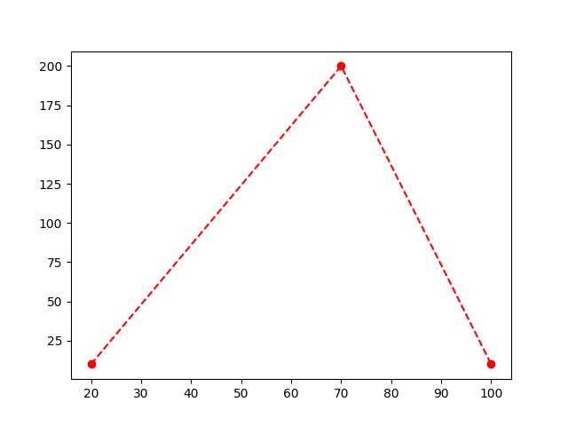
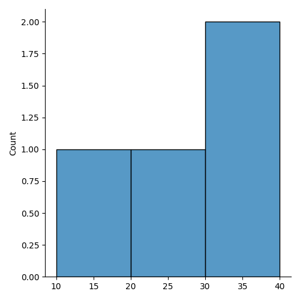

# PYTHON_LIBRARIES

## Project Overview

**Title**: PYTHON_LIBRARIES
**Python_Libraries**: `NUMPY,PANDAS,MATPLOTLIB,SEABORN`

This repository contains hands-on practice with essential Python libraries used in data analysis and visualization. The focus is on building a strong foundation by working with the following libraries:

 ## Libraries Covered
 
### NumPy:

- Understanding data storage
- Working with different dimensions (0D, 1D, 2D...)
- Using .ndim to check the number of dimensions
- Assigning dimensions using ndmin
- Performing basic arithmetic operations
- Slicing the data
```python
import numpy as np
# NUMPY LIBRARY
lst=np.array([4,9,6,7])
print(lst)
#.....................................
lst1=np.array(4)  #0D
lst2=np.array([4,9,6,7])  #1D
lst3=np.array([[7,9,7,5],[3,2,6,7]])  #2D
print(lst1.ndim)
print(lst2.ndim)
print(lst3.ndim)
#......................................
lst4=np.array([4,8,7,9])
print(lst4[1]+lst4[2])   # FOR ADDITION
#......................................
lst5=np.array([4,5,6,7])
print(lst5[2:4])   #FOR SLICINHG
#......................................
```

### Pandas:

- Creating and displaying Series and DataFrames
- Setting custom indexes
- Importing/exporting CSV files
- Exploring data using .head() and .tail()
```python
import pandas as pd
#........................................
a=["Ali","Ahmed","Saad","Haris","Zain"]
pt=pd.Series(a)
print(pt)
#.........................................
name=["Ali","Ahmed","Saad","Haris","Zain"]
pt=pd.Series(name,index=["a","b","c","d","e"])
print(pt)
#.......................................
# Data Frame
data={
    "Name":["Ali","Ahmed","Zain","Haris","Saad"],
    "age":[20,22,23,19,27],
    "city":["Lahore","Islamabad","Karachi","Lahore","Sialkot"],
}

print(pd.DataFrame(data))

#.......................................
# From CSV
df=pd.read_csv("C:/Users/A.N.T/Desktop/PYTHON P1/Sheet.csv")
print(df.to_string())
# Top 5
print(df.head(5))
# Below 5
print(df.tail(5))
#.........................................
```

### Matplotlib:

- Creating basic plots and line graphs
- Customizing lines, points, and markers for clarity
  
```python
import matplotlib.pyplot as pt
import numpy as np
#.........................
xpt=np.array([20,70,100])
ypt=np.array([10,200,10])
pt.plot(xpt,ypt,'o--r')
pt.show()
#.........................
```

### Seaborn:

- Enhancing data visualizations with aesthetically pleasing and informative graphs

```python
import matplotlib.pyplot as pt
import seaborn as sns
#............................
sns.displot([10,20,30,40])
pt.show()
#............................
```

### Objective:

- Practice core Python libraries: NumPy, Pandas, Matplotlib, and Seaborn.
- Learn array creation, dimensions, slicing, and operations using NumPy.
- Work with Pandas to create DataFrames, read CSV files, and explore data.
- Visualize data with Matplotlib using lines, markers, and styles.
- Create clean visualizations using Seaborn.
- This foundational knowledge is key for further exploration into data science and analytics.


- **LinkedIn**: [Connect with me professionally](www.linkedin.com/in/smtahaimran)

Thank you for your interest in this project!
